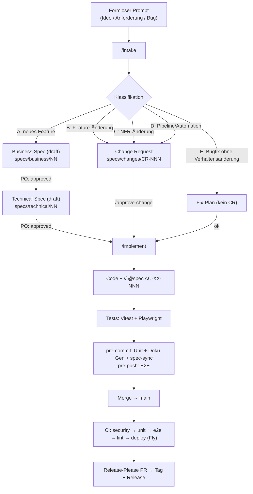
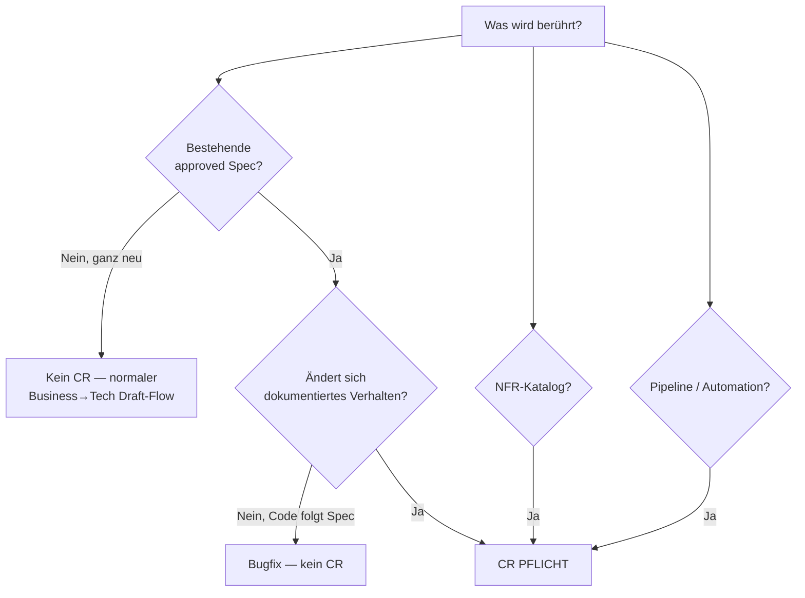
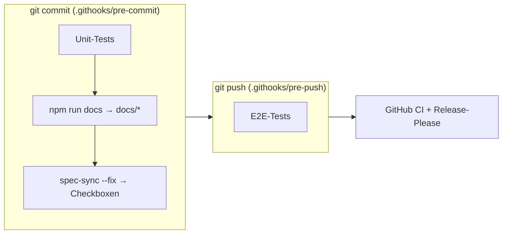

# Lösungs-Überblick – Wie bei PromptArena aus einem Prompt Software wird

> **Zweck dieser Datei:** *eine* Landkarte über **alle Aspekte** der Lösung — vom formlosen Wunsch
> bis zum Release. Wer neu ist, liest diese Datei zuerst; Details stehen in den verlinkten Dokumenten.
>
> Ergänzende Tiefe: menschlicher Leitfaden `docs/SPEC-DRIVEN-DEVELOPMENT.md`, Gesetz
> `specs/constitution.md`, CR-Regeln `specs/changes/WORKFLOW.md`.

---

## 1. Das Prinzip in einem Satz

**Die Spec ist die Wahrheit — Code, Tests und Doku folgen ihr, nie umgekehrt.** Jede Änderung
beginnt als *freigabereifer Entwurf*, wird *freigegeben* und erst dann *umgesetzt, getestet und
dokumentiert*.

---

## 2. Der Lebenszyklus (End-to-End)

Blockiert: `/implement` verweigert die Umsetzung, wenn eine `approved` Spec ohne genehmigtes CR
geändert würde oder ein CR ≠ `approved` ist.

---

## 3. Alle Artefakte auf einen Blick

| Aspekt | Datei(en) | Wer pflegt | ID-Schema | CR-geschützt |
|--------|-----------|-----------|-----------|:---:|
| **Was** wir bauen | `specs/business/NN-*.md` | PO / BA | `BAC-NN-NNN` | ✅ (ab `approved`) |
| **Wie** wir es bauen | `specs/technical/NN-*.md` | Dev / Claude | `AC-NN-NNN` | ✅ (ab `approved`) |
| **Nichtfunktionale** Ziele | `specs/non-functional.md` | Dev | `NFR-<KAT>-NNN` | ✅ |
| **Pipeline** (CI/CD) | `specs/technical/99-pipeline.md` + `.github/workflows/` | Dev | `AC-99-NNN` | ✅ |
| **Automation** (Doku/Hooks/Sync) | `specs/technical/98-automation.md` + `scripts/`, `.githooks/` | Dev | `AC-98-NNN` | ✅ |
| **Änderungsanträge** | `specs/changes/CR-NNN-*.md` | PO / Dev | `CR-NNN` | — |
| **Gesetz** (Prinzipien) | `specs/constitution.md` | alle | — | ✅ (Breaking-Change-Prozess) |
| **Code** | `app/`, `lib/`, `components/`, … | Dev | `// @spec AC-NN-NNN` | folgt der Spec |
| **Generierte Doku** | `docs/00-08*.md` | *Generator* | — | via 98 |
| **Menschliche Doku** | `docs/SPEC-DRIVEN-DEVELOPMENT.md`, `docs/SECURITY-AUDIT-*.md` | Mensch | — | — |

---

## 4. Governance – wann braucht es ein Change Request?

Freigabe-Zuständigkeit (Details `specs/changes/WORKFLOW.md`): Es gibt **eine** Freigabe-Instanz —
den **Product Owner**. Eine separate Tech-Freigabe existiert nicht; jede Änderung (fachlich wie
technisch, inkl. NFR/Pipeline/Automation) braucht die PO-Freigabe.

---

## 5. Befehle & Werkzeuge (vollständig)

| Zweck | Aufruf |
|-------|--------|
| **Einstieg im Zweifel** — klassifiziert + erzeugt Entwurf | `/intake <beschreibung>` |
| Business-Spec schreiben (neu) | `/specify-business <beschreibung>` |
| Technical-Spec ableiten | `/specify-tech <feature-nr>` |
| Change Request erstellen | `/change-request <feature> <beschreibung>` |
| CR freigeben | `/approve-change CR-NNN approve` |
| Umsetzen (nach Freigabe) | `/implement [AC-XX-NNN]` |
| Tasks planen / anzeigen | `/plan` · `/tasks` |
| Spec↔Code synchronisieren | `/sync fix` bzw. `node scripts/spec-sync.mjs [--fix\|--watch]` |
| Doku generieren | `npm run docs` · `npm run docs:watch` |
| Tests | `npm run test:unit` · `npm run test:e2e` |
| Git-Hooks aktivieren | `npm run setup:hooks` |

---

## 6. Automatik, die alles konsistent hält

- **Doku-Generator** (`scripts/generate-docs.ts`) liest den echten Code (Prisma-Schema, API-Routen,
  Punkte, Deps, ENV, Migrationen) → `docs/*.md`. Diese sind **generierte Artefakte, nicht von Hand
  editieren**. Governance: `specs/technical/98-automation.md`.
- **spec-sync** (`scripts/spec-sync.mjs`) prüft, dass jede `AC-NN-NNN` im Code (`// @spec`) auftaucht
  → Abdeckungs-Wahrheitscheck (`NFR-MAINT-004`).
- **CI** (`specs/technical/99-pipeline.md`): security → unit → e2e → lint → deploy (Fly), nur `main`.
- **Release-Please**: einziger Tagging-Mechanismus (Semver aus Conventional Commits).

---

## 7. ID-Konventionen

| Präfix | Ebene | Beispiel | Vergeben in |
|--------|-------|----------|-------------|
| `BAC-NN-NNN` | Business-Akzeptanzkriterium | `BAC-10-001` | Business-Spec |
| `AC-NN-NNN` | Technisches Akzeptanzkriterium | `AC-10-001` | Technical-Spec, im Code als `// @spec` |
| `NFR-<KAT>-NNN` | Nichtfunktionale Anforderung | `NFR-PERF-001` | NFR-Katalog, im Code als `// @nfr` |
| `CR-NNN` | Change Request | `CR-001` | `specs/changes/` |

`NN` = zweistellige Feature-Nummer · `NNN` = dreistellige Laufnummer.

---

## 8. Abdeckung (Feature-Landkarte)

Alle Kern-Features haben Business- **und** Technical-Spec (Status `approved`) und laufenden Code.
Querschnitt-Specs 98/99 + NFR-Katalog gelten über alle Features.

| Nr | Feature | Business | Technical |
|----|---------|:--------:|:---------:|
| 00 | Produkt-Vision / Architektur | ✅ | ✅ |
| 01 | Identität (Registrierung/Login) | ✅ | ✅ |
| 02 | Prompt-Bibliothek | ✅ | ✅ |
| 03 | Bewertung (Voting) | ✅ | ✅ |
| 04 | Gamification (Punkte/Level/Rangliste) | ✅ | ✅ |
| 05 | Favoriten | ✅ | ✅ |
| 06 | Wöchentliche Challenges | ✅ | ✅ |
| 07 | Admin-Panel | ✅ | ✅ |
| 08 | Lernpfade | ✅ | ✅ |
| 09 | Erweitertes Lernen | ✅ | ✅ |
| 10 | Profil & Badges | ✅ | ✅ |
| 11 | Nutzer-Feedback | ✅ | ✅ |
| 12 | E-Mail-Authentifizierung | ✅ | ✅ |
| 13 | Öffentliche Startseite | ✅ | ✅ |
| 98 | Automation (Doku/Hooks/Sync) | — | ✅ |
| 99 | CI/CD-Pipeline | — | ✅ |
| — | NFR-Katalog (querschnittlich) | — | `specs/non-functional.md` |

Aktueller Wahrheits-Check: `node scripts/spec-sync.mjs` (Ampel + Prozent-Abdeckung).

---

## 9. Rollen

| Rolle | Verantwortung |
|-------|---------------|
| **Product Owner (PO)** | **Einzige Freigabe-Instanz** — gibt Business-, Technical-, NFR-, Pipeline- und Automation-Specs sowie alle CRs frei |
| **Developer** | Umsetzung nach Spec, `@spec`-Annotationen, Tests |
| **Claude** | `/intake`-Routing, Entwürfe erstellen, implementieren, synchronisieren — **nie** ohne Freigabe |

---

## 10. Offene Wartungspunkte

- Generator-Drift in `scripts/generate-docs.ts` (hartkodiert „Next.js 14/React 18"; `NFA`-Liste als
  Dublette zum NFR-Katalog) → Korrektur nur via CR-D. Erfasst in `specs/technical/98-automation.md`.
- `specs/constitution.md` §3 nennt teils ältere Versionsstände als CLAUDE.md — bei Gelegenheit via
  CR angleichen.

---

*Diese Übersicht ist handgepflegt (kein Generator-Ziel). Bei strukturellen Änderungen an der Lösung
mit-aktualisieren.*
